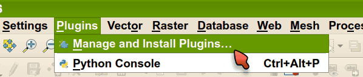
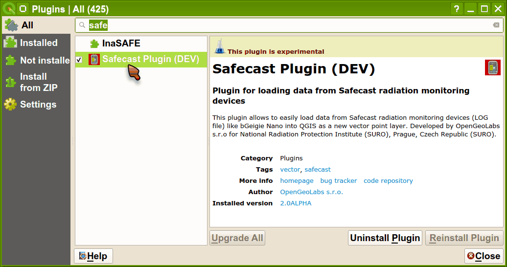
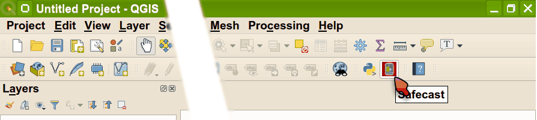
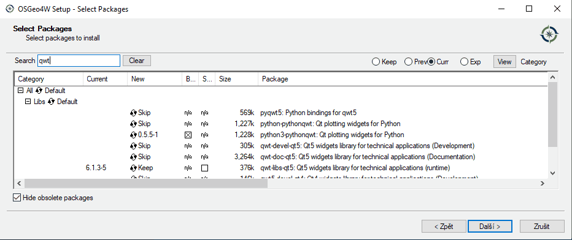

Installation
============

Go to :menuselection:`Plugins --> Manage and Install Plugins`:

   Plugins menu.

You should have **Safecast Plugin** available in QGIS plugins selection
and you can install it:

   Plugins menu - install Safecast plugin.
   
and the plugin icon appears in the QGIS toolbar:

   Safecast plugin in QGIS toolbar.

and now the plugin is ready to use.

Graphs support
--------------

In order to display :ref:`graph_tab` *PythonQwt* or *Qwt6* library is
required by Safecast plugin. None of these libraries are part of
standard QGIS installation.

MS Windows
^^^^^^^^^^

*PythonQwt* can be installed throuh `OSGeo4W Network Installer
<https://qgis.org/en/site/forusers/download.html>`__. Choose
`Advanced Install`. In section `Libs` enable `python3-pythonqwt`
package in order to install it.

   Install `python3-pythonqwt` from OSGeo4W Network Installer.

.. important:: This procedure requires that QGIS has been installed
   using OSGeo4W Network Installer and not by Standalone Installer!

Ubuntu Linux
^^^^^^^^^^^^

*Qwt6* library is available only on newer versions of Ubuntu operating
system (19.04 and following). It can be installed by following
command:

.. code-block:: bash

   sudo apt install python3-pyqt5.qwt

On Ubuntu 18.04 install *PythonQwt* library instead:

.. code-block:: bash

   sudo pip3 install PythonQwt
